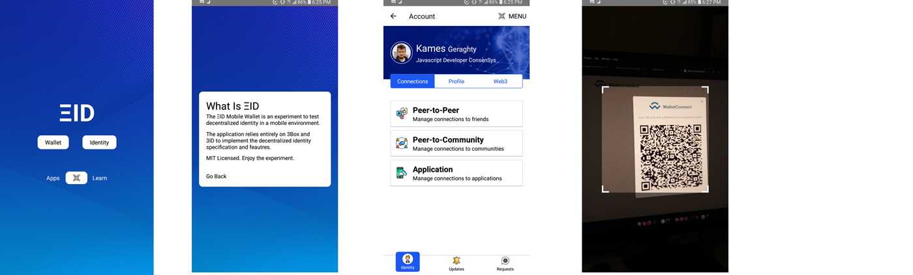

# ΞID Mobile

ΞID Mobile is an Open Source Decentralized Identity wallet.

MIT License. **Freedom.**

Built as a playground to experiment with decentralized identity and emerging standards like 3ID and the latest developments by 3Box. The application will focus on features like verifiable credentials, decentralized profiles, social interactions (search, following, communities), managing spaces and other less explored ideas like peer-to-peer verifiable credentials.


## 👷🚧 Getting Started - Under Construction 🚧🏗️

Rapid prototype warning. The primary prototyping focus was to create the navigation, routes and include the 3 major dependencies: IdentityWallet, WalletConnect and Ethers. That's complete. Now the fun begins 🎉 However, it's still a little rough around the edges and requires a digital soul cleansing.

#### Major Dependencies

- React Native: `0.61.3`
- IdentityWallet: `0.2.1`
- Ethers: `4.0.39` (upgrading to v5 soon - testing external effect)
- WalletConnect: `1.0.0-beta.38`

As is customary with Ethereum focused React Native applications we also `node-if-ied` React Native.

`rn-nodeify --install --hack`

Have questions about the current setup and approach? Tweet me at <a href="twitter.com/kamescg">@kamescg</a>

Depending on how 3Box handles IPFS integration into React Native the application may include non-normative approaches to shimming React Native to include additional decentralized capabilities. Until a decision has been reached, the application will utilize JSON-RPC to make request to the blockchain and IPFS storage.

### Setup

```
git clone git@github.com:KamesCG/ethid-mobile.git ; cd ethid-mobile ; yarn
```

#### Android

`yarn run:android`

#### IOS

The IOS version is behind in development. IOS coming soon (wait) or creat pull request today! The choice is yours.

##### The Current Roadmap

The current prototype was to outline the navigation components, setup the routes/routing and include the 3 major dependencies: `identity-wallet`, `@walletconnect/react-native`, and `ethers`.

#### In Progress

- IdentityWallet (Decentralized Identity) MVP
- WalletConnect (Cross-Device JSON-RPC)
- Ethers (Crypto My Dude!)

#### Next

What are we going to build next? I have a few ideas... However, I think the feature candidates should include input from people interested in the project. If any?

- Simple Identity/Profile Setup
- Peer-to-Peer Verifiable Credentials
- Feature Complete Identity Wallet JSON RPC System Manager
- Feature Complete WalletConnect JSON RPC System Manager
- Both 3ID and uPort `ethr-did` support (IPFS/Blockchain)



Ultimately the objective is to modularize the core _"decentralized"_ features. Allowing patterns that emerge around verifiable credentials, decentralized profiles, automated IPFS pinning, delegate key management, etc... to be abstracted and easily migrated to new appliations.

If decentralized identity is too succee a blossoming ecosystem with 100's of applications is likely required. Thus, from a Product Engineering perspective it makes sense to create an MIT Licensed feature/component catalog for Web3 developers and decentralized application development teams to utilize and contribute too.

What types of patterns are likely to emerge you ask?

- Decentralized Profile Best Practices
- Verifiable Credential Type Indexing/Search
- Functional Web3 Intefaces (React Hooks, Effects and Reducers)

## What

An Experiment to understand decentralized identity in the mobile environment. The experiment seeks to understand what is the optimal method(s) to onboard new users into a decentralized environment. The verifiable credential part of decentralized is new, and explored territory. A lot can be learned from a feature driven, MIT license project. The project is MIT licensed to promote contributions and forks.

- Optimal Decentralized Identity Onboarding
- Peer-to-Peer Verifiable Credentials
- Multi-IPFS Hub Support and Linking
- 3ID Standard Experimentation
- Burner/Delegate Key System
- Multi-Device Communication (WalletConnect)

## Why

A number of reasons. A big reason being 3Box has released the `identity-wallet` module and, in general starting to mature the core decentralized identity features: authentication, storage and communication. It's a great time to be a Web3 Developer.

The primary reason is I just want a really great decentralized identity wallet. A completely open and free to use codebase that will let me extend, experiment and invite new contributors.

# Project Overview

Interesting in an Open Source decentralized identity wallet? Want to contribute or just use the code? Follow the current build process and project overview.

- Timline
- Application Structure

## Timeline

### Pre-Sprint Planning

- [ ] Typescript or Flow?

### Sprint 1

- [ ] Finish `emotion` primitive integration
  - [ ] match `theme-ui` sx prop for better cross-application compability
- [ ] IdentityWallet System v0.0.1
  - [ ] Define All Types/Actions
  - [ ] Define All Effects
  - [ ] Finalize Effects
- [ ] WalletConnect System v0.0.1
  - [ ] Define All Types/Actions
  - [ ] Define All Effects
  - [ ] Finalize Effects
- [ ] Ethers System v0.0.1
  - [ ] Define All Types/Actions
  - [ ] Define All Effects
  - [ ] Finalize Effects
- [ ] Primitive Key Management System (Alpha Testing)
- [ ] WalletConnect Listener Singleton

### Sprint 2

- [ ] Decentralized Profile
- [ ] Decentralized Profile Search
- [ ] Finalize IdentityWalletRPC Screen
  - [ ] Authenticate
  - [ ] SignClaim
- [ ] Finalize WalletRPC Screen
  - [ ] Send Transaction
  - [ ] Sign Transaction
  - [ ] Sign Message
  - [ ] Sign Typed Message
- [ ] Finalize Wallet Screen

### Sprint 3

- [ ] Storage Navigation
  - [ ] StorageList Screen
  - [ ] StorageItem Screen
- [ ] Messaging Navigation
  - [ ] ThreadList Screen
  - [ ] ThreadItem Screen
  - [ ] GhostThreadList Screen

## Application Structure

### Screens

- Authentication
  - Login
  - Create Account
  - Import Account
- Account
  - Persona(Identity)
  - Manage
  - Requests
- Storage
  - Storage List
  - Stroage Item
- Communications
  - Thread List
  - Ghost Thread List
- Connections
  - Peer
    - Highlighted
    - Timeline
    - Archived
  - Community
    - Highlighted
    - Timeline
    - Archived
  - Application
    - Highlighted
    - Timeline
    - Archived
- Verifications
  - Social
    - Twitter
    - Github
  - Peer-to-Peer
    - Friends
  - Application
- Overview
  - Guide
  - Settings

### Navigation

- Authentication
- Main
  - Profile
    - Verifications
  - Storage
    - Public
    - Private
  - Messaging
- QRScanner
- Wallet
- WalletTransactions
